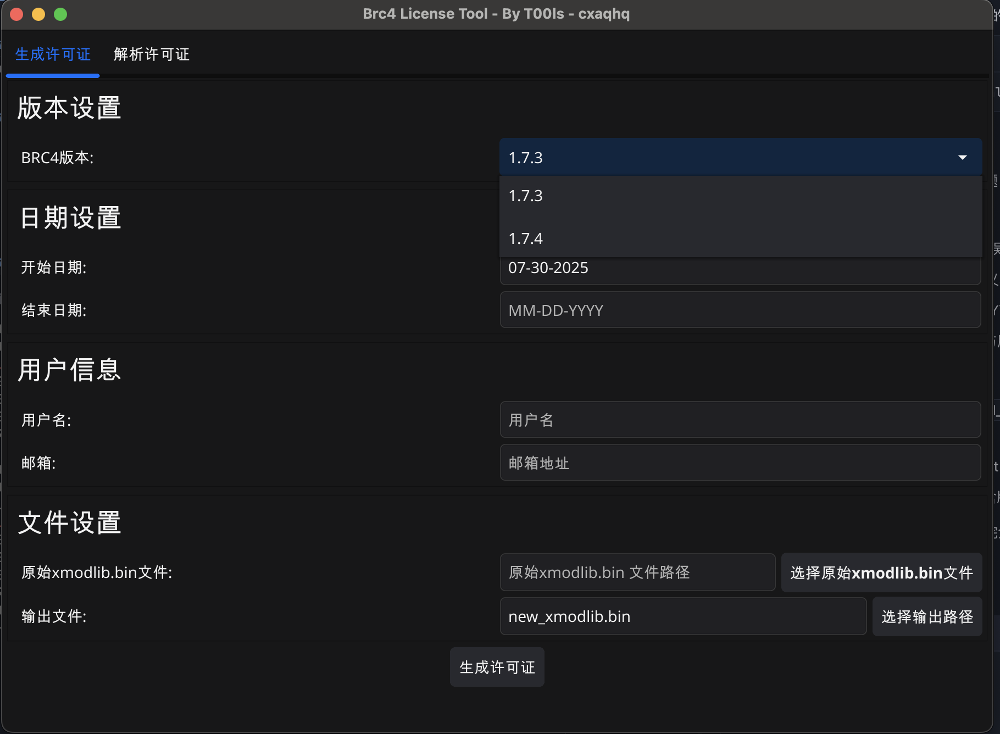
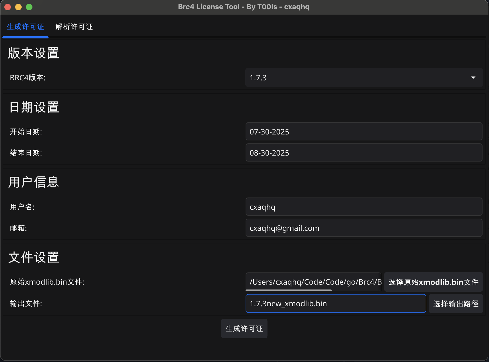
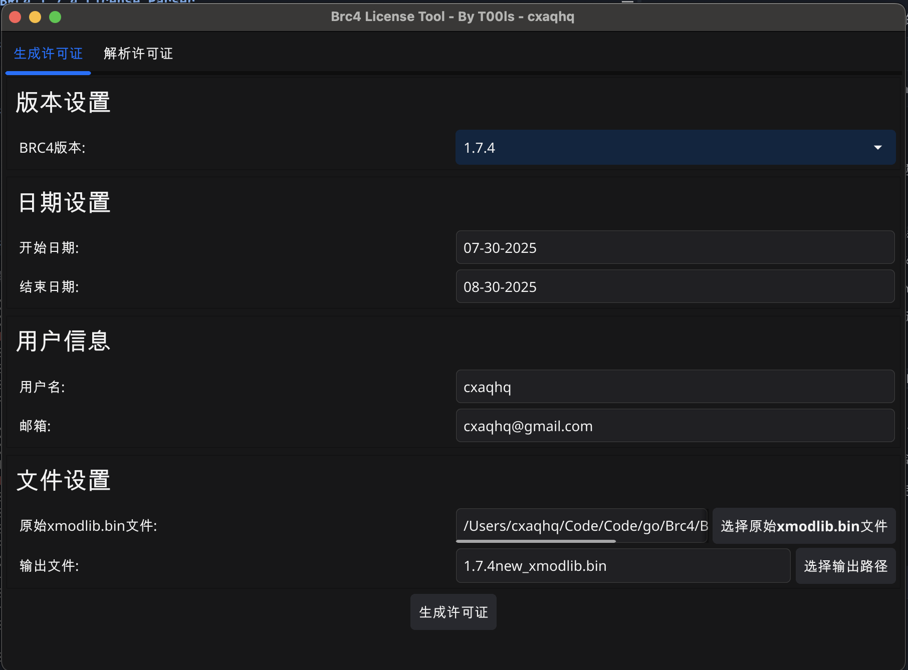
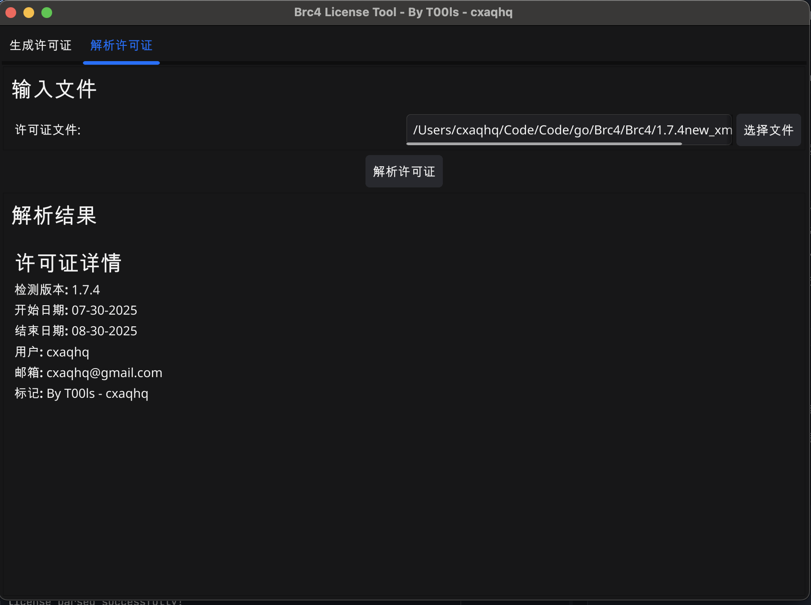

# BRC4 License Tool 使用指南

## 概述

BRC4 License Tool 是一个用于生成和解析 BRC4 许可证文件的工具，支持 1.7.3 和 1.7.4 两个版本。工具提供了命令行界面（CLI）和图形用户界面（GUI）两种使用方式。

## 功能特性

- 支持生成 1.7.3 和 1.7.4 版本的许可证文件
- 支持解析现有的许可证文件
- 自动检测许可证文件版本
- 提供友好的图形界面和强大的命令行工具
- 支持自定义许可证参数（日期、用户、邮箱等）

## 安装与编译

### 编译 CLI 工具

```bash
cd src
go build -o ../brc4_tool
```

### 编译 GUI 工具

```bash
# 使用提供的脚本
./build_gui_only.sh

# 或手动编译
cd src
go build -tags gui -o ../brc4_gui
```

## CLI 使用方法

### 基本语法

```bash
./brc4_tool [command] [options]
```

### 生成许可证文件

#### 生成 1.7.3 版本许可证

```bash
./brc4_tool gen --date-start 01-01-2022 --date-end 01-08-2025 --user brute --email brute@active.com --payloads xmodlib.bin --output new_xmodlib.bin --version 1.7.3
```

#### 生成 1.7.4 版本许可证

```bash
./brc4_tool gen --date-start 01-01-2022 --date-end 01-08-2025 --user brute --email brute@active.com --payloads 1.7.4xmodlib.bin --output new_1.7.4xmodlib.bin --version 1.7.4
```

### 解析许可证文件

```bash
# 解析许可证文件
./brc4_tool dec --input xmodlib.bin

# 解析 1.7.4 版本文件
./brc4_tool dec --input 1.7.4xmodlib.bin
```

### 参数说明

#### 生成命令参数 (gen)

- `--date-start`: 许可证开始日期 (格式: MM-DD-YYYY)
- `--date-end`: 许可证结束日期 (格式: MM-DD-YYYY)
- `--user`: 用户名
- `--email`: 用户邮箱
- `--payloads`: 载荷文件路径（原始 bin 文件）
- `--output`: 输出文件路径
- `--version`: 版本号 (1.7.3 或 1.7.4)

#### 解析命令参数 (dec)

- `--input`: 要解析的许可证文件路径

### 使用示例

```bash
# 示例1: 生成一个有效期为3年的1.7.4许可证
./brc4_tool gen \
  --date-start 01-01-2024 \
  --date-end 12-31-2026 \
  --user "John Doe" \
  --email "john@example.com" \
  --payloads 1.7.4xmodlib.bin \
  --output license_2024.bin \
  --version 1.7.4

# 示例2: 解析生成的许可证文件
./brc4_tool dec --input license_2024.bin

# 示例3: 生成1.7.3版本许可证
./brc4_tool gen \
  --date-start 06-01-2024 \
  --date-end 06-01-2025 \
  --user "Test User" \
  --email "test@company.com" \
  --payloads xmodlib.bin \
  --output test_license.bin \
  --version 1.7.3
```

## GUI 使用方法

### 启动 GUI

```bash
# macOS ARM64
./release/brc4_gui_darwin_arm64

# Windows
./release/brc4_gui_windows_amd64.exe
```

### GUI 界面说明

GUI 提供了直观的图形界面，包含以下功能：



*GUI界面总览 - 主界面包含生成和解析两个主要功能模块*

#### 1. 许可证生成

- **版本选择**: 选择要生成的许可证版本（1.7.3 或 1.7.4）
- **日期设置**: 
  - 开始日期：许可证生效日期
  - 结束日期：许可证过期日期
- **用户信息**:
  - 用户名：许可证持有者姓名
  - 邮箱：许可证持有者邮箱地址
- **文件选择**:
  - 载荷文件：选择原始的 bin 文件作为载荷
  - 输出文件：指定生成的许可证文件保存位置



*1.7.3版本许可证生成界面*



*1.7.4版本许可证生成界面*

#### 2. 许可证解析

- **文件选择**: 选择要解析的许可证文件
- **解析结果**: 显示许可证的详细信息，包括：
  - 检测到的版本
  - 开始和结束日期
  - 用户名和邮箱
  - 许可证标记


*1.7.3版本许可证解析界面*



*1.7.4版本许可证解析界面*

### GUI 操作步骤

#### 生成许可证

1. 启动 GUI 应用
2. 选择"生成许可证"选项卡
3. 选择目标版本（1.7.3 或 1.7.4）
4. 填写开始日期和结束日期
5. 输入用户名和邮箱
6. 选择载荷文件（原始 bin 文件）
7. 指定输出文件路径
8. 点击"生成"按钮
9. 等待生成完成提示

#### 解析许可证

1. 选择"解析许可证"选项卡
2. 点击"选择文件"按钮，选择要解析的许可证文件
3. 点击"解析"按钮
4. 查看解析结果

## 注意事项

### 文件格式要求

- 日期格式必须为 MM-DD-YYYY
- 载荷文件必须是有效的 BRC4 bin 文件
- 输出文件建议使用 .bin 扩展名

### 版本兼容性

- 1.7.3 版本使用加密的许可证数据
- 1.7.4 版本使用明文许可证数据，文件大小通常更大
- 不同版本的载荷文件不能混用

### 常见问题

1. **"slice bounds out of range" 错误**
   - 通常是文件损坏或版本不匹配导致
   - 确保使用正确版本的载荷文件

2. **文件大小不匹配**
   - 1.7.4 版本会自动添加填充以匹配原始文件大小
   - 如果仍有问题，检查载荷文件是否完整

3. **日期格式错误**
   - 确保使用 MM-DD-YYYY 格式
   - 月份和日期需要补零（如 01-01-2024）

## 技术支持

如遇到问题，请检查：

1. Go 版本是否兼容（推荐 Go 1.19+）
2. 载荷文件是否完整且版本正确
3. 输入参数格式是否正确
4. 文件权限是否足够

---

**开发者**: T00ls - cxaqhq  
**版本**: 支持 BRC4 1.7.3 和 1.7.4